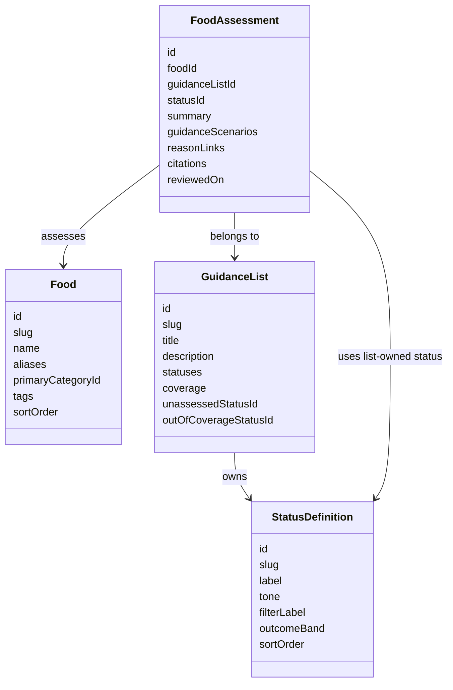

# F-05: Add Independent Guidance Lists

**Status:** Proposed

**Depends on:** [F-01: Browse the Food Guide](<01-browse-food-guide.md>), [F-02: Search and Filter Foods](<02-search-and-filter-foods.md>), [F-03: Explain Food Guidance](<03-explain-food-guidance.md>), and [F-04: Maintain Trustworthy Guidance Content](<04-maintain-trustworthy-guidance-content.md>)

**Governing decisions:** [independent guidance lists](<../decisions/2026-08-04 ADR - use independent guidance lists for food assessments.md>), [version-controlled static content](<../decisions/2026-08-04 ADR - store reviewed guide content as version-controlled static data.md>), and [canonical reason foods](<../decisions/2026-08-04 ADR - link assessments to canonical reason foods.md>)

## Goal

Let Polly narrow one catalogue by the dietary scopes she cares about, starting with pregnancy by
default and adding vegetarian suitability without turning food classification into hard-coded
booleans.

## Primary experience

1. Open the guide and see pregnancy guidance selected by default.
2. Add vegetarian suitability as an additional dietary scope when she wants foods that satisfy both
   pregnancy and vegetarian needs.
3. Narrow the selected scopes with generic outcome filters: "Okay", "Maybe - see notes", and "Not
   okay".
4. Read each matching food's list-specific labels, summaries, source links, conditions, and review
   dates without navigating to a duplicated catalogue.
5. Open the same food detail and see all relevant guidance sections for that food, with the selected
   scopes preserved as return context.

```text
Polly's Food Guide

Search foods: [ cheese                                      ]

Filters
  Category
    [ All categories v ]

  Dietary scopes
    [x] Pregnancy
    [ ] Vegetarian

  Outcome
    [ ] Okay
    [ ] Maybe - see notes
    [ ] Not okay

Results
  Cheddar
    Pregnancy: OK to eat
    Vegetarian: Vegetarian

  Brie
    Pregnancy: Avoid
    Vegetarian: Vegetarian
```

When pregnancy and vegetarian scopes are both selected with "Okay" and "Maybe - see notes", a food
appears only if both selected scopes resolve to either "Okay" or "Maybe - see notes".

```text
| Food            | Pregnancy          | Vegetarian         | Shows? |
| --------------- | ------------------ | ------------------ | ------ |
| Cheddar         | Okay               | Okay               | Yes    |
| Brie            | Not okay           | Okay               | No     |
| Leftovers       | Maybe - see notes  | Okay               | Yes    |
| Gelatin dessert | Okay               | Not okay           | No     |
| Yoghurt         | Not assessed       | Okay               | No     |
| Tiramisu        | Maybe - see notes  | Maybe - see notes  | Yes    |
```



## Required behaviour

- A new list supplies its own title, description, coverage declaration, source-version evidence,
  distinct grey fallback states, statuses, generic outcome-band mappings, and assessments.
- A food may have one assessment per list; it does not gain a new property such as
  `isVegetarian`.
- Pregnancy is the default selected dietary scope when the catalogue opens without explicit scope
  state.
- Selecting multiple dietary scopes is cumulative: a food must satisfy every selected scope.
- Selecting multiple generic outcomes is alternative: a selected scope may match any selected
  outcome.
- Missing assessment remains a domain fallback, represented as "Not assessed" inside the list's
  coverage or "Outside current coverage" outside it. Missing guidance is never treated as "Okay" and
  is not a primary RAG filter unless a later maintainer workflow needs an explicit incomplete-content
  view.
- Status colour is controlled by the list definition while label and meaning remain list-specific.
- Composite or brand-dependent foods use an explicit "Check ingredients" style outcome rather than
  an unjustified binary answer. A cited reason can link to a canonical ingredient food such as
  Gelatin, but the composite food retains its own list-specific assessment.
- The unreleased URL contract is replaced rather than migrated: query state uses selected dietary
  scopes and generic outcomes instead of a selected display list.
- Active filters are visibly labelled, and unknown scope, category, or outcome values in a shared URL
  are removed and announced accessibly.

## Non-goals

- Ingredient-level recipe analysis.
- Vegan, halal, allergy, or other lists unless they are separately reviewed and added as a new
  guidance-list configuration.
- User-specific dietary preference profiles.

## Assumptions and open questions

- **Resumed from Deferred:** F-01, F-02, F-03, and F-04 are all `Done`, so the original deferral
  condition (complete F-03 and prove the pregnancy content workflow) is now satisfied.
- **Governing decision:** [show scoped guidance with generic outcome filters](<../decisions/2026-08-06 ADR - show scoped guidance with generic outcome filters.md>)
  requires the default pregnancy scope, generic outcome bands, and replacement unreleased URL
  contract.
- **Still open:** reviewed vegetarian source material, its ownership, and its coverage declaration
  are not yet defined. Resolve these before moving to `Planned` and creating an implementation plan.

## Acceptance criteria

- The same named cheese can be green for vegetarian suitability and amber for pregnancy safety.
- Adding a vegetarian list does not create a second set of category or food records.
- The catalogue defaults to pregnancy scope when opened without explicit URL state.
- Selecting pregnancy and vegetarian scopes with "Okay" and "Maybe - see notes" only shows foods
  whose resolved outcomes are okay or maybe in both selected scopes.
- A food inside a selected scope's coverage without an assessment is labelled "Not assessed", while
  an uncovered food is labelled "Outside current coverage"; neither state is treated as "Okay".
- The primary outcome filters are generic and stable while cards and detail pages still show each
  guidance list's own status labels and source-backed explanations.

## Validation

When implemented, retain the repository-wide 100% global statements, branches, functions, and lines
coverage thresholds for application source. Add domain tests for outcome-band mapping and
AND-across-selected-scopes filtering, query tests for the replacement unreleased URL contract, and
Chromium Playwright tests for default pregnancy scope, vegetarian-only filtering, pregnancy +
vegetarian filtering, list-specific status labels, and direct food-detail URLs.
