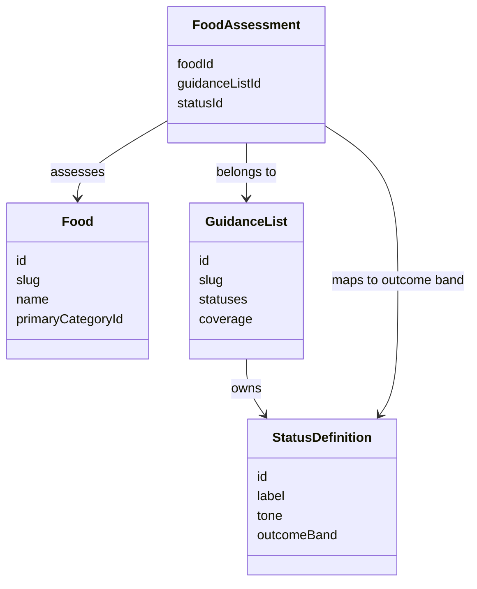

# F-08: Rework Guidance-Scope Filtering

**Status:** Proposed

**Depends on:** [F-05: Add Independent Guidance Lists](<05-add-independent-guidance-lists.md>)

**Governing decisions:** [independent guidance lists](<../decisions/2026-08-04 ADR - use independent guidance lists for food assessments.md>), [version-controlled static content](<../decisions/2026-08-04 ADR - store reviewed guide content as version-controlled static data.md>), and [show scoped guidance with generic outcome filters](<../decisions/2026-08-06 ADR - show scoped guidance with generic outcome filters.md>)

## Goal

As Polly, I need to narrow one catalogue by the dietary scopes that matter to me so that I can find
foods that satisfy pregnancy and vegetarian suitability together without translating separate
list-specific status filters.

## Primary experience

1. Open the guide with pregnancy selected by default.
2. Add vegetarian suitability as another dietary scope when both constraints matter.
3. Narrow selected scopes with "Okay", "Maybe - see notes", or "Not okay".
4. Read each result's list-specific labels, summaries, sources, conditions, and review details.

```text
Polly's Food Guide

Dietary scopes
  [x] Pregnancy
  [ ] Vegetarian

Outcome
  [ ] Okay
  [ ] Maybe - see notes
  [ ] Not okay

Cheddar
  Pregnancy: OK to eat
  Vegetarian: Vegetarian
```

Selecting Pregnancy and Vegetarian with Okay and Maybe - see notes shows only foods whose resolved
outcome is Okay or Maybe - see notes in both scopes.

| Food | Pregnancy | Vegetarian | Shows? |
| --- | --- | --- | --- |
| Cheddar | Okay | Okay | Yes |
| Brie | Not okay | Okay | No |
| Leftovers | Maybe - see notes | Okay | Yes |
| Yoghurt | Not assessed | Okay | No |



## Required behaviour

- Keep `Food` and `Category` free from pregnancy, vegetarian, or global-status fields.
- Map every list-owned status to exactly one generic outcome band: `okay`, `maybe`, `not-okay`,
  `not-assessed`, or `outside-coverage`.
- Default an absent URL scope to pregnancy food safety.
- OR selected outcome bands within every selected scope and AND selected scopes with category/search
  predicates.
- Keep `not-assessed` and `outside-coverage` as distinct neutral fallbacks; neither is safe nor a
  primary RAG filter.
- Replace the unreleased `list=` and `status.<list-slug>` URL shape with `scope=` and `outcome=`.
- Show list-specific labels, citations, conditions, and non-colour status signals on cards and
  detail pages.

## Non-goals

- Changing the reviewed vegetarian data, its coverage, or its citations.
- Adding recipe/ingredient analysis, user profiles, or further dietary lists.
- Treating missing assessment or outside coverage as safe.

## Assumptions and open questions

- The accepted ADR defines the replacement URL contract and filtering semantics.
- F-05 supplies the existing pregnancy and vegetarian assessments required to validate combined
  scopes.
- Move this feature to `Planned` only after an approved F-08 implementation plan records affected
  code, test files, rollout checks, and direct-URL scenarios.

## Acceptance criteria

- The catalogue defaults to pregnancy scope when its URL has no scope.
- Pregnancy plus vegetarian with Okay and Maybe - see notes includes only foods matching those bands
  in both scopes.
- The primary outcome controls do not expose Not assessed as a normal RAG choice, while missing
  guidance remains visibly neutral wherever it is rendered.
- A copied filtered URL reproduces the scopes and outcomes in a fresh browser session.
- The same food continues to use one food record and independently resolved list assessments.

## Validation

Run focused domain tests for outcome-band mapping, coverage fallbacks, and AND-across-scope filtering;
React Testing Library coverage for scope/outcome controls and cards; Chromium tests for default,
combined, and direct filtered URLs; then the repository coverage, lint, type-check, and production
build quality gates.
